<p align="center">
  <picture>
    <source media="(prefers-color-scheme: dark)" srcset="Logos/symbol-dark.svg" />
    <source media="(prefers-color-scheme: light)" srcset="Logos/symbol-light.svg" />
    
  </picture>
</p>

<h1 align="center">exímIA Meter</h1>

<p align="center">
  <strong>macOS menu bar app for monitoring Claude Code usage and costs in real-time</strong>
</p>

<p align="center">
  <a href="https://github.com/eximIA-Ventures/eximia-meter/releases"></a>
  
  
  
  <a href="LICENSE"></a>
</p>

<p align="center">
  <a href="#installation">Install</a> •
  <a href="#features">Features</a> •
  <a href="#how-it-works">How It Works</a> •
  <a href="#architecture">Architecture</a> •
  <a href="#configuration">Configuration</a> •
  <a href="#troubleshooting">Troubleshooting</a>
</p>

---

## Overview

**exímIA Meter** lives in your macOS menu bar and gives you full visibility into your [Claude Code](https://docs.anthropic.com/en/docs/claude-code) token consumption — weekly limits, daily burn rate, per-project breakdown, cost estimates, and smart alerts.

It reads local files from `~/.claude/` and optionally connects to the Anthropic API for real-time data. **No API keys required for basic usage. No network calls needed. Everything runs locally.**

### Why?

Claude Code's Pro/Max plans have weekly token limits but no built-in dashboard. exímIA Meter fills that gap — showing exactly where your tokens go, when you'll hit the limit, and how much it would cost at API pricing.

---

## Features

### Dashboard

| Feature | Description |
|---------|-------------|
| **Weekly & Session Usage** | Progress bars with countdown to reset |
| **Burn Rate Projection** | Estimates when you'll hit the weekly limit and % remaining at reset |
| **Model Distribution** | Visual breakdown of Opus / Sonnet / Haiku usage (7 days) |
| **Per-Project Usage** | Token consumption by project with relative bars |
| **Project Cards** | Quick-launch projects, change model, update AIOS — all from the popover |

### Insights

| Feature | Description |
|---------|-------------|
| **Cost Estimation** | Estimated USD cost for the past 7 days, weighted by model |
| **Usage Streak** | Consecutive days with activity |
| **Week-over-Week** | % change compared to the previous week |
| **Sparkline Chart** | 7-day token usage bar chart |
| **Activity Heatmap** | 24-hour activity grid with intensity levels |
| **Peak Detection** | Alert when today's usage is 2x+ above average |
| **Model Suggestion** | Recommends cheaper model when Opus dominates >60% |

### Notifications

| Feature | Description |
|---------|-------------|
| **Threshold Alerts** | Warning and critical alerts for session & weekly usage |
| **Hysteresis** | 5% margin prevents notification spam when usage fluctuates |
| **Adaptive Cooldown** | Escalates from 5 min to 4 h cooldown after first fire |
| **Weekly Report** | Sunday summary with tokens, sessions, cost, and streak |
| **Idle Detection** | Welcome-back notification after 4 h+ of inactivity |
| **macOS Native** | Notification Center banners, custom sounds (14 system sounds) |

### Project Management

| Feature | Description |
|---------|-------------|
| **Auto-Discovery** | Finds projects in `~/.claude/projects/` |
| **Groups** | Organize projects into custom groups with drag & drop |
| **Rename Detection** | Detects renamed directories and offers to update paths |
| **Custom Colors** | Color picker for each project (10 quick colors + custom) |
| **Visibility Toggle** | Show/hide projects on the main page |
| **Drag & Reorder** | Reorder projects by dragging |

### Work Time Tracker

| Feature | Description |
|---------|-------------|
| **Active Window Detection** | Tracks time spent in terminals/IDEs using macOS Accessibility API |
| **Session Tracking** | Automatic sessions based on activity windows |
| **Work Patterns** | Visualize your coding patterns throughout the day |

### Other

| Feature | Description |
|---------|-------------|
| **Export CSV** | Export all usage data (tokens, messages, sessions, cost, per-project) |
| **Self-Update** | Check for updates and install directly from the app |
| **Admin Mode** | Secret code activation for beta channel access |
| **Changelog Popup** | Auto-shows what's new after each update |
| **Dark Mode** | Forced dark theme with custom design tokens |
| **Menu Bar Indicators** | Color-matched usage indicators with opacity gradient |

---

## Installation

### npm (recommended)

```bash
npx @eximia-ventures/meter
```

### Shell Script

```bash
curl -fsSL https://raw.githubusercontent.com/eximIA-Ventures/eximia-meter/main/install.sh | bash
```

### Manual Build

```bash
git clone https://github.com/eximIA-Ventures/eximia-meter.git
cd eximia-meter
swift build -c release
bash build-app.sh release
cp -r "dist/exímIA Meter.app" /Applications/
open "/Applications/exímIA Meter.app"
```

### Requirements

| Requirement | Minimum |
|-------------|---------|
| **macOS** | 14.0 (Sonoma) |
| **Xcode CLT** | `xcode-select --install` |
| **Claude Code** | Any version with at least one usage session |

---

## How It Works

### 3-Layer Hybrid Data System

exímIA Meter combines three data sources, prioritizing accuracy:


| Layer | Source | Priority | Description |
|-------|--------|----------|-------------|
| 1 | Anthropic OAuth API | Highest | Real-time utilization % and reset times |
| 2 | Local `.jsonl` scan | Medium | Exact token counts from session logs |
| 3 | `stats-cache.json` | Fallback | Estimated from cached statistics |

### File System Sources

```
~/.claude/
├── statsig/
│   └── usage_data.json    # API-level usage stats
├── projects/
│   └── <project-dir>/
│       └── *.jsonl         # Per-session detailed logs (Layer 2)
└── statsig/
    └── ...                 # OAuth credentials (auto-detected)
```

### Notification Flow

```mermaid
flowchart LR
    A["Usage\nUpdated"] --> B{"Above\nthreshold?"}
    B -- No --> C["✅ No action"]
    B -- Yes --> D{"Hysteresis\ncheck (5%)"}
    D -- "Fluctuating" --> C
    D -- "Confirmed" --> E{"Cooldown\nactive?"}
    E -- Yes --> C
    E -- No --> F["🔔 Send\nNotification"]
    F --> G["Start adaptive\ncooldown\n(5min → 4h)"]
```



### Self-Update Flow

```mermaid
flowchart TD
    A["Check for Updates"] --> B["Fetch remote Info.plist\nfrom GitHub"]
    B --> C{"Remote version\n> local?"}
    C -- No --> D["✅ Up to date"]
    C -- Yes --> E["Show Update Banner"]
    E --> F["User clicks\nUpdate Now"]
    F --> G["Write updater script\nto /tmp"]
    G --> H["Launch nohup process"]
    H --> I["Quit app"]
    I --> J["Updater waits\nfor app to exit"]
    J --> K["Clone → Build → Sign"]
    K --> L["Replace .app bundle"]
    L --> M["Relaunch app"]
```



---

## Architecture

```
EximiaMeter/
├── App/                        # AppDelegate, entry point
├── Models/                     # Data models
│   ├── Project, UsageData      # Core domain
│   ├── ClaudeModel, ClaudePlan # Claude-specific enums
│   ├── Changelog               # Version history
│   └── WorkSession             # Time tracking
├── Services/                   # Business logic
│   ├── CLIMonitorService       # FSEvents file watcher + polling fallback
│   ├── ProjectUsageService     # Per-project .jsonl scanning with caching
│   ├── UsageCalculatorService  # 3-layer hybrid calculation
│   ├── AnthropicUsageService   # OAuth API client
│   ├── NotificationService     # Alerts with hysteresis & persistence
│   ├── ProjectDiscoveryService # Auto-discover Claude projects
│   └── WorkTimeService         # Active window tracking
├── ViewModels/                 # Observable view models
├── Views/
│   ├── MenuBar/                # Popover UI (dashboard, cards, insights)
│   ├── Settings/               # Settings window (6 tabs)
│   ├── Onboarding/             # First-launch wizard
│   └── Shared/                 # Design system (ExButton, ExProgressBar, etc.)
└── Storage/                    # UserDefaults persistence
```

### Design Decisions

| Decision | Choice | Rationale |
|----------|--------|-----------|
| UI Framework | SwiftUI + AppKit | SwiftUI for views, AppKit for NSPopover/NSWindow |
| Observation | `@Observable` | Modern Swift observation, not Combine |
| Dependencies | Zero | No SPM packages — ships self-contained |
| Menu Bar | NSPopover | Native macOS menu bar experience |
| Design System | `ExTokens` enum | Centralized colors, typography, spacing, radii |
| Data Refresh | 60s polling + FSEvents | Balanced between freshness and CPU usage |
| Notifications | UNUserNotificationCenter | Native macOS Notification Center |

---

## Configuration

### First Launch

1. Click the menu bar icon (top-right corner)
2. Go to **Settings** (gear icon)
3. Select your **Claude plan**:

| Plan | Weekly Token Limit |
|------|--------------------|
| Pro | ~100M tokens |
| Max 5x | ~500M tokens |
| Max 20x | ~2B tokens |

4. Configure alert thresholds (optional)
5. Add project folders via **Projects** tab or use **Discover**

### API Connection (Optional)

If Claude Code is authenticated via OAuth, the app auto-detects credentials from `~/.claude/` and uses the Anthropic API for precise usage data. No manual configuration needed.

### Menu Bar Style

Choose between display modes in Settings → General:

| Style | Description |
|-------|-------------|
| **Logo Only** | Clean, minimal — just the exímIA icon |
| **Logo + Usage** | Shows session (S) and weekly (W) usage indicators |

Indicators are color-coded: 🟢 green (<50%), 🟠 orange (50-80%), 🔴 red (>80%).

### Popover Size

Configurable in Settings → General:

| Size | Best For |
|------|----------|
| Compact | Quick glance |
| Normal | Default experience |
| Large | More project cards visible |
| Extra Large | Full analytics at a glance |

---

## Updating

### From the App

Go to **Settings → About → Check for Updates**. If a new version is available, click **Update Now** — the app will download, build, and reinstall automatically.

An update banner also appears on the main popover when a new version is detected.

### From Terminal

```bash
npx @eximia-ventures/meter
```

or

```bash
curl -fsSL https://raw.githubusercontent.com/eximIA-Ventures/eximia-meter/main/install.sh | bash
```

### Beta Channel

Activate **Admin Mode** in Settings → About to access the beta update channel with early features.

---

## Uninstall

From the app: **Settings → About → Uninstall**

Or manually:

```bash
rm -rf "/Applications/exímIA Meter.app"
defaults delete com.eximia.meter
```

Or via script:

```bash
curl -fsSL https://raw.githubusercontent.com/eximIA-Ventures/eximia-meter/main/uninstall.sh | bash
```

---

## Troubleshooting

| Problem | Solution |
|---------|----------|
| **No data shown** | Use Claude Code at least once to generate `~/.claude/` files |
| **Build failed** | Run `xcode-select --install` to install Swift toolchain |
| **App not in menu bar** | It runs as a menu bar app (no Dock icon). Look for the icon near the clock |
| **macOS blocks the app** | System Settings → Privacy & Security → scroll down → "Open Anyway" |
| **Notifications not working** | System Settings → Notifications → exímIA Meter → Allow Notifications |
| **Stale data** | Click the timestamp in the footer to force a manual refresh |
| **OAuth not detected** | Make sure Claude Code is authenticated (`claude` → sign in) |
| **Work Time not tracking** | Grant Accessibility permission in System Settings → Privacy & Security → Accessibility |

---

## Tech Stack

| Component | Technology |
|-----------|------------|
| **Language** | Swift 5.9+ |
| **UI** | SwiftUI + AppKit (NSPopover, NSWindow) |
| **Target** | macOS 14+ (Sonoma) |
| **Build** | Swift Package Manager |
| **Dependencies** | None (zero external packages) |
| **Codebase** | ~11,000 lines across 57 Swift files |

---

## Contributing

1. Fork the repository
2. Create a feature branch (`git checkout -b feat/my-feature`)
3. Make your changes
4. Build and test (`swift build`)
5. Commit with conventional commits (`feat:`, `fix:`, `docs:`, etc.)
6. Open a Pull Request

---

## License

[MIT](LICENSE)

---

<p align="center">
  <sub>Built with <a href="https://docs.anthropic.com/en/docs/claude-code">Claude Code</a></sub>
</p>
